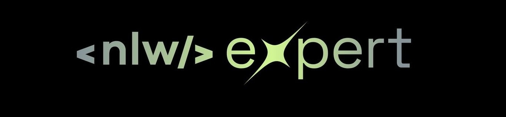
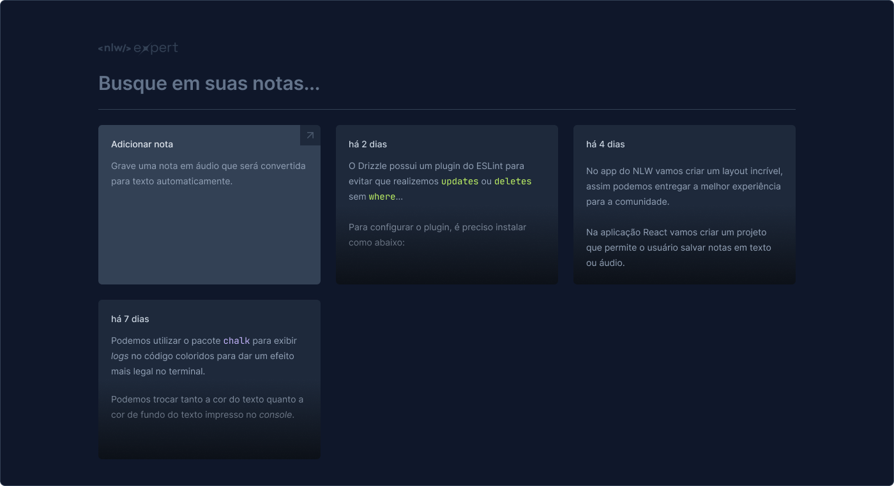

<div align="center" id="top">
  
  <h1>Tela da aplicação em funcionamento</h1>
  

  &#xa0;

</div>

<h1 align="center">Nlw Expert Nodes</h1>

<p align="center">
  

  

  

  

</p>

<hr>

<p align="center">
  <a href="#dart-sobre">Sobre</a> &#xa0; | &#xa0;
  <a href="#sparkles-funcionalidades">Funcionalidades</a> &#xa0; | &#xa0;
  <a href="#rocket-tecnologias">Tecnologias</a> &#xa0; | &#xa0;
  <a href="#white_check_mark-requisitos">Requisitos</a> &#xa0; | &#xa0;
  <a href="#checkered_flag-iniciando">Iniciando</a> &#xa0; | &#xa0;
  <a href="#memo-licença">Licença</a> &#xa0; | &#xa0;
  <a href="https://github.com/andrelinos" target="_blank">Autor</a>
</p>

<br>

## :dart: Sobre ##

A aplicação de notas é uma ferramenta intuitiva e versátil que permite aos usuários capturar e organizar ideias de maneira eficiente. Utilizando tecnologias modernas como Vite.js, React.js com TypeScript e diversas bibliotecas complementares, oferece uma experiência de usuário fluida e poderosa.

## :sparkles: Funcionalidades ##

:heavy_check_mark: Adicionar novas notas;\
:heavy_check_mark: Deletar notas;\
:heavy_check_mark: Buscar notas salvas;\
<!-- :heavy_check_mark: Editar notas; -->

## :rocket: Tecnologias ##

As seguintes ferramentas foram utilizadas neste projeto:

- [Vite.js](https://vitejs.dev/)
- [React.js com TypeScript](https://pt-br.reactjs.org/)
- [Zod](https://github.com/colinhacks/zod)
- [@radix-ui](https://radix-ui.com/)
- [Lucide-react](https://github.com/lucide-icons/lucide)
- [React-Dom](https://reactjs.org/docs/react-dom.html)
- [React-Hook-Form](https://react-hook-form.com/)
- [Sonner](https://github.com/lukeed/sonner)
- [Date-fns](https://date-fns.org/)
- [TailwindCSS](https://tailwindcss.com/)

## :white_check_mark: Requisitos ##

Antes de começar :checkered_flag:, você precisa ter o [Git](https://git-scm.com) e o [Node](https://nodejs.org/en/) instalados.

## :checkered_flag: Iniciando ##

```bash
# Clone este repositório
$ git clone https://github.com/andrelinos/nlw-expert-nodes

# Acesse
$ cd nlw-expert-nodes

# Instale as dependências
$ npm install

# Execute o projeto
$ npm run dev

# O servidor iniciará em <http://localhost:3000>
```

## :memo: Licença ##

Este projeto está sob licença MIT. Para mais detalhes, veja o arquivo LICENSE.

Feito com :heart: por <a href="https://github.com/andrelinos" target="_blank">andrelinos</a>

<a href="#top">Voltar ao topo</a>
